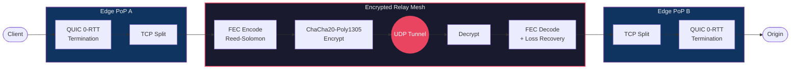

# Entrouter Line

[](https://github.com/Entrouter/entrouter-line/actions/workflows/ci.yml)
[](https://crates.io/crates/entrouter-line)
[](LICENSE)
[](https://www.rust-lang.org)
[]()

**Zero-loss cross-region packet relay network.**

Adaptive FEC, encrypted UDP tunnels, real-time latency-mesh routing, and QUIC 0-RTT edge termination. Written in Rust.

> **Use case:** Deploy relay nodes at global PoPs to eliminate packet loss and reduce tail latency between regions. Drop-in improvement for any TCP workload crossing unreliable or high-latency links.

---

## What This Does

Relays packets between globally distributed PoP (Point of Presence) nodes with:

- **Zero packet loss up to 10% link loss** - adaptive Reed-Solomon FEC absorbs all loss with zero throughput impact
- **Zero relay overhead** - measured loss exactly matches simulated network loss, the relay adds nothing
- **Optimal routing** via real-time latency mesh with Dijkstra shortest-path (not BGP)
- **Instant connections** via QUIC 0-RTT + TCP splitting at edge
- **Always-encrypted** tunnels with ChaCha20-Poly1305

## Benchmarks

Tested on London ↔ Sydney (~271ms RTT) over Vultr shared VPS - one of the longest internet routes on Earth, on budget infrastructure.

### FEC Loss Recovery

| Link Loss | Throughput vs Baseline | Status |
|-----------|----------------------|--------|
| 0% | 100% | Baseline |
| 5% | 100% | **Perfect recovery** |
| 10% | 99% | **Perfect recovery** |
| 20% | 87% | Matches theoretical prediction within 1% |
| 22% | 83% | Graceful degradation |
| 25%+ | FAIL | QUIC control plane limit (see below) |

### Relay Overhead

| Link Loss | Relay Added Loss |
|-----------|-----------------|
| 1% | **0%** |
| 5% | **0%** |
| 10% | **0%** |
| 20% | **0%** |

The relay introduces zero additional packet loss at any tested loss level. Encryption, header routing, and tunnel forwarding add no measurable overhead.

### Relay vs Direct TCP (A/B Comparison)

Same two nodes, same link, same loss - relay tunnel vs raw TCP:

| Loss | Relay p95 | Direct TCP p95 | Winner |
|------|----------|----------------|--------|
| 0% | 280ms | 271ms | TCP by 9ms |
| 1% | **280ms** | **758ms** | **Relay by 478ms** |
| 3% | 280ms | 817ms | **Relay by 537ms** |
| 5% | **280ms** | **1089ms** | **Relay by 809ms** |

At baseline, the relay adds ~9ms (3.5%) for encryption + FEC + UDP tunnelling. But at **any non-zero packet loss**, the relay delivers dramatically lower tail latency because FEC absorbs loss silently - no TCP retransmit delays.

> Relay latency is dead-flat at ~280ms whether there's 0% or 5% loss. Direct TCP p95 degrades linearly.

### Infrastructure Limits (Not Code Limits)

- **~140 Mbps throughput cap:** Vultr VPS NIC/bandwidth allocation, not the relay. On bare metal or higher-tier VPS, throughput scales with the NIC.
- **25%+ loss failure:** At 25% unidirectional loss over 273ms RTT, each QUIC round-trip faces ~44% compound loss. No QUIC implementation (Quinn, quiche, msquic) survives this. This is a physical link constraint, not a relay limitation. On shorter routes or better infrastructure, the operational ceiling is higher.
- **Real-world context:** Internet backbone loss between major cities is typically 0.01–2%. This relay handles that range with zero visible loss. Even 10–20% loss (damaged undersea cable territory) still delivers 87%+ throughput.

Full benchmark methodology and raw data: [BENCHMARK-RESULTS.md](BENCHMARK-RESULTS.md)

---

## Requirements

- **Rust 1.87+** (edition 2024)
- Linux recommended for production (UDP socket optimizations via `socket2`)
- Builds and tests on Windows, macOS, and Linux

---

## Installation

### Pre-built binaries

Download from [GitHub Releases](https://github.com/Entrouter/entrouter-line/releases) - available for Linux (amd64/arm64), macOS (amd64/arm64), and Windows.

### Cargo

```bash
cargo install entrouter-line
```

### Docker

```bash
docker build -t entrouter-line .
docker run -v ./config.toml:/etc/entrouter/config.toml \
  -p 4433:4433/udp -p 8443:8443 -p 4434:4434/udp -p 9090:9090 \
  entrouter-line
```

### Build from source

```bash
cargo build --release
```

## Quick Start

### 1. Configure

Copy the example config and edit for your nodes:

```bash
cp config.example.toml config.toml
```

```toml
node_id = "us-east-01"
region = "us-east"

[listen]
relay_addr = "0.0.0.0:4433"
tcp_addr   = "0.0.0.0:8443"
quic_addr  = "0.0.0.0:4434"
admin_addr = "127.0.0.1:9090"

[[peers]]
node_id    = "eu-west-01"
region     = "eu-west"
addr       = "1.2.3.4:4433"
shared_key = "base64-encoded-32-byte-key"
```

Generate a shared key:
```bash
openssl rand -base64 32
```

### 2. Run

```bash
entrouter-line --config config.toml
```

The admin API is available at `http://127.0.0.1:9090`:
- `GET /health` - liveness check
- `GET /status` - peer connections, latency matrix, routing table

---

## Architecture



Latency-mesh routing (Dijkstra on EWMA probe data) dynamically selects the fastest path between PoPs - not the BGP default.

## Project Structure

```
src/
├── main.rs              # Entry point
├── config.rs            # Node & peer configuration
├── relay/               # Core relay engine
│   ├── tunnel.rs        # Encrypted UDP tunnels
│   ├── fec.rs           # Adaptive Forward Error Correction
│   ├── forwarder.rs     # Packet forwarding & routing
│   ├── crypto.rs        # ChaCha20-Poly1305 encryption
│   └── wire.rs          # Binary wire protocol
├── mesh/                # Routing mesh
│   ├── probe.rs         # Latency probing
│   ├── router.rs        # Dijkstra shortest-path routing
│   └── latency_matrix.rs
└── edge/                # Edge termination
    ├── tcp_split.rs     # TCP connection splitting
    └── quic_acceptor.rs # QUIC 0-RTT acceptor
```

## Test Scripts

The `deploy/` directory contains benchmark and test scripts:

| Script | Description |
|--------|-------------|
| `bench_relay_vs_direct.py` | A/B comparison: relay tunnel vs raw TCP (latency + throughput at multiple loss levels). Requires two remote nodes and `paramiko`. |
| `bench_throughput.py` | Bulk throughput benchmark (localhost) |
| `bench_mtu.py` | MTU discovery benchmark (localhost) |
| `bench_ratelimit.py` | Rate-limited throughput test (localhost) |
| `simple_test.py` | Basic relay connectivity test (localhost) |
| `coord_bench.py` | Coordinated two-node benchmark launcher |
| `netem_bench.py` | Netem-based loss simulation benchmark |
| `sync_bench.py` | Synchronized bidirectional benchmark |

## Running Tests

```bash
cargo test
```

Run the full benchmark suite (requires [Criterion](https://github.com/bheisler/criterion.rs)):

```bash
cargo bench
```

## Security

All inter-node traffic is encrypted with ChaCha20-Poly1305. Shared keys are pre-configured per peer - no PKI required for the relay mesh. Optional TLS termination is available at the edge.

See [SECURITY.md](SECURITY.md) for vulnerability reporting.

## Contributing

Pull requests welcome. Please run `cargo test` and `cargo clippy` before submitting.

## License

[Apache 2.0](LICENSE) - Copyright (c) 2025 Entrouter


